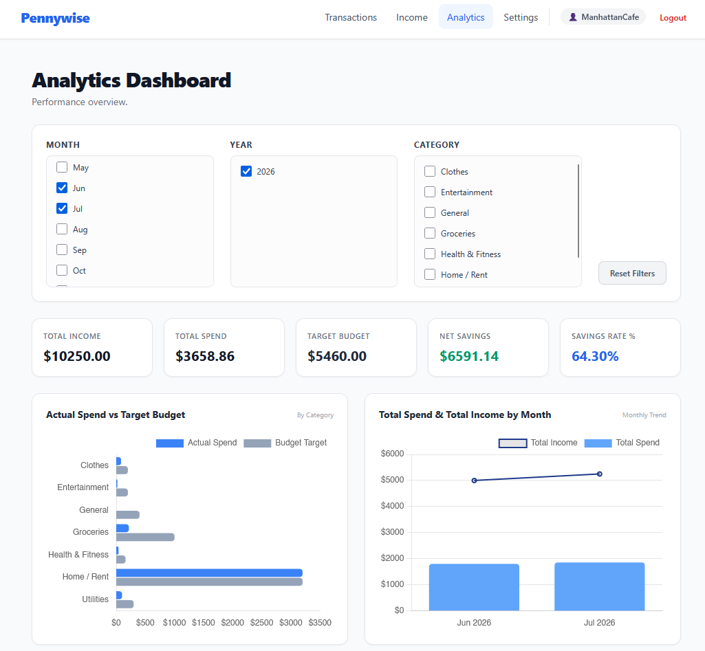
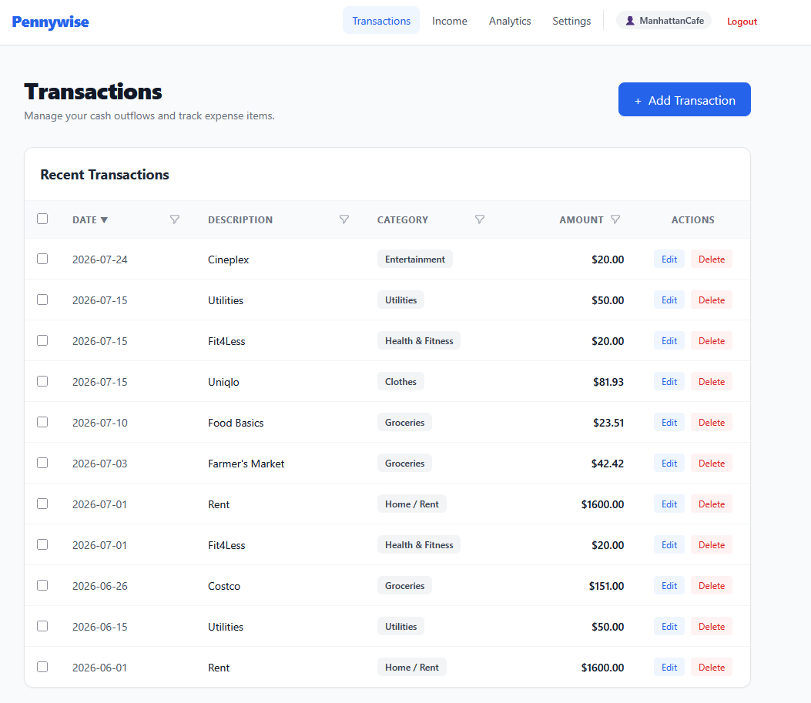
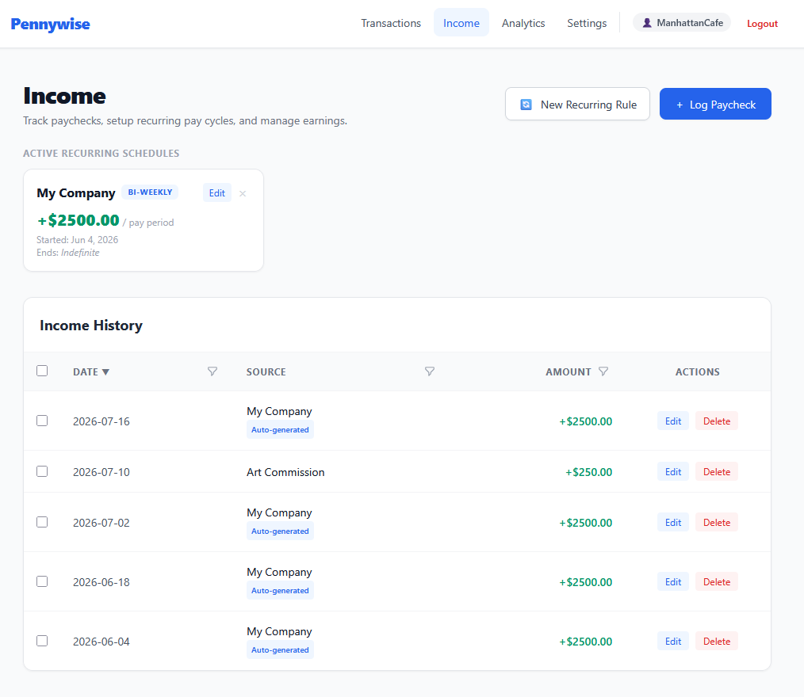
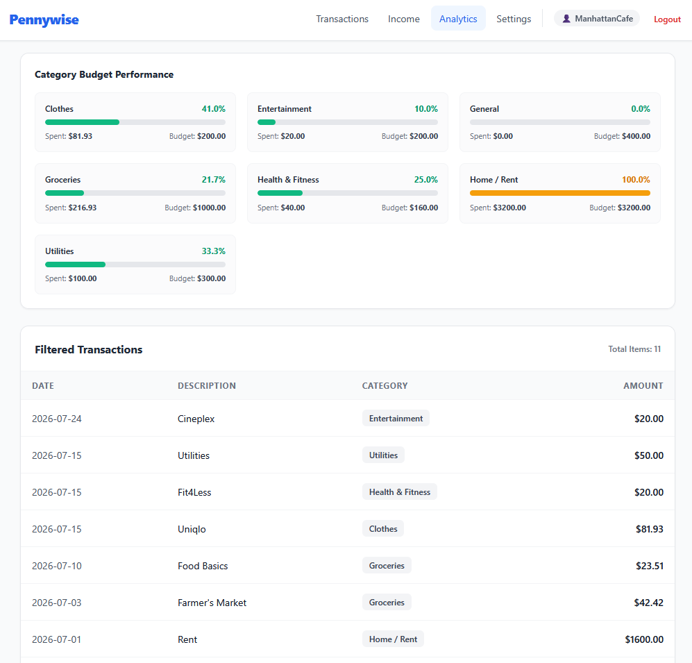
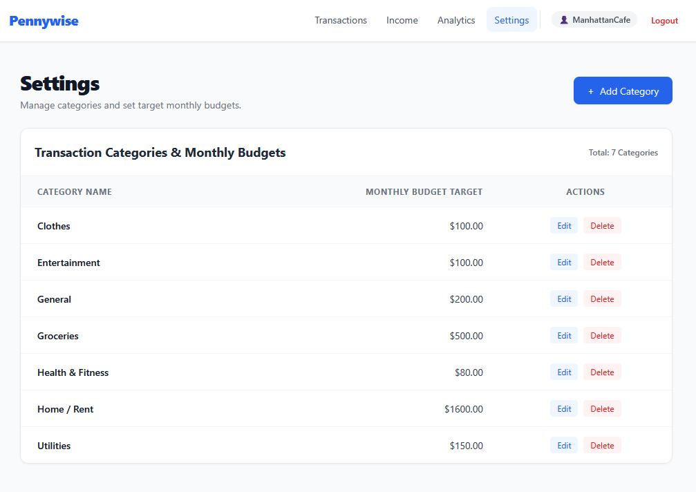

# 🪙 Pennywise — Personal Finance & Analytics Platform

[](https://www.python.org/)
[](https://www.djangoproject.com/)
[](https://tailwindcss.com/)
[](https://htmx.org/)
[](https://www.postgresql.org/)

> **Pennywise** is a full-stack personal finance application engineered to track transactions, automate recurring income pipelines, manage category budgets, and deliver dynamic BI reporting via real-time analytics dashboards.


---

## 📌 Features & Highlights
* **🔍 Transaction Filtering:**
  * Server-side pagination (25 items/page), multi-category filtering, date ranges, amount bounds, and dynamic column sorting using **HTMX** for fast SPA-like partial page updates without full reloads.
  
* **💸 Automated Recurring Income Sync:**
  * Engine that projects historical and upcoming paychecks across configurable frequencies (Weekly, Bi-Weekly, Monthly).
  * Auto-populates missing income records while handling manual skips or custom paycheck overrides.
  
* **📊 Dynamic Analytics & BI Dashboard:**
  * Interactive Chart.js visualizations for category budget allocation, monthly spend vs. income trends, and net savings rate.
  * Real-time progress indicators with status color thresholds (Emerald / Amber / Red) for monthly budget variance tracking.
  
  
* **🔁 Recurring Expense Rules:**
  * The same projection engine applied to expenses — define a rule once (rent, subscriptions) and it back-fills history and keeps itself topped up, honouring per-date skips.
* **⚙️ Settings and Configuration:**
  * Configure the spending categories you care about and the allocated monthly budget
  * Profile avatar upload, password change, dark mode toggle, and CSV export of transactions and income
  


---

## 🛠️ Technical Architecture & Tech Stack

* **Backend Framework:** Python / Django (ORM, Class/Function-Based Views, Authentication)
* **Frontend UI & Interactivity:** Tailwind CSS, HTMX, Chart.js
* **Database:** SQLite (Development/UAT)
* **Data Processing & Analytics:** Django Aggregations (`Sum`, `Coalesce`, `ExtractMonth/Year`), `dateutil.relativedelta`

---
## 📈 Key Database Models & Schema Design

| Model | Description | Key Relationships & Constraints |
| :--- | :--- | :--- |
| **`Category`** | User-defined budget buckets with target limits. | `ForeignKey(User)` <br> • *Constraint:* Unique together (`user`, `name`) |
| **`CategoryBudget`** | Effective-dated budget history, so past months are scored against the budget in force at the time. | `ForeignKey(Category, CASCADE)` <br> • *Constraint:* Unique together (`category`, `effective_start_date`) |
| **`Transaction`** | Individual expense entries mapped to a date and category. | `ForeignKey(User)` <br> • `ForeignKey(Category, SET_NULL)` <br> • `ForeignKey(RecurringTransactionTemplate, SET_NULL)` |
| **`RecurringTransactionTemplate`** | Recurring *expense* rules (frequency, start/end date, category) and skipped date tracking. | `ForeignKey(User)` <br> • `ForeignKey(Category, SET_NULL)` |
| **`PaycheckTemplate`** | Recurring salary rules (frequency, start date, source) and skipped date tracking. | `ForeignKey(User)` |
| **`PaycheckTransaction`** | Historical and auto-generated income entries. | `ForeignKey(User)` <br> • `ForeignKey(PaycheckTemplate, SET_NULL)` |
| **`Profile`** | Per-user profile holding the uploaded avatar. | `OneToOneField(User, CASCADE)` |

Both recurring templates share a `RecurringSchedule` mixin that projects
occurrence dates from `frequency` / `start_date` / `end_date`, minus any dates
the user has explicitly skipped.

---

## 🖥️ Local Development Setup

### 1. Prerequisites
Ensure you have **Python 3.10+** and **Git** installed on your machine.

### 2. Clone the Repository & Set Up Virtual Environment
```bash
git clone https://github.com/kevzjhu/pennywise.git
cd pennywise

# Create virtual environment
python -m venv .venv

# Activate virtual environment
# On Windows (PowerShell):
.\.venv\Scripts\Activate.ps1
# On macOS/Linux:
source .venv/bin/activate
```

### 3. Install Dependencies
```bash
pip install -r requirements.txt
```

### 4. Create a `.env` file
`DEBUG` defaults to off, which turns on `SECURE_SSL_REDIRECT` and the hashed
static-file manifest — neither works under `runserver`. Local development needs
`DEBUG` on:

```bash
cat > .env <<'ENV'
DEBUG=True
SECRET_KEY=any-value-works-when-DEBUG-is-True
ENV
```

With `DEBUG` off, `SECRET_KEY` is mandatory and `CSRF_TRUSTED_ORIGINS` must
list the deployment's own origins (comma-separated).

### 5. Run Migrations & Seed Admin User
```bash
python manage.py migrate

# Create superuser for Django Admin access
python manage.py createsuperuser
```

### 6. Start Development Server
```bash
python manage.py runserver
```

### Running the tests
`collectstatic` must run first to build the static manifest, since Django's test
runner forces `DEBUG=False`:

```bash
python manage.py collectstatic --noinput
python manage.py test
```

---
## 📝 To Do List:
- Transactions: Add import functionality for CC transactions (CSVs)
  - Done: WS, RBC, TD
  - To do: Pennywise exports, CIBC, Scotiabank, Simplii, Amex, BMO
- ~~Add settings page (under user profile) - put dark mode, export data~~ — done
- Change current settings to "budget config" owtte
- Analytics: ~~Sankey~~ done. ML? Time-series analyses? open to suggestions
- Deploy and UAT with friends
- Mobile app

---
## 📄 License & Author

Developed by Kevin Hu  
*Health Informatics & Data Analytics Professional*

📧 [Email Me](mailto:kevzjhu@gmail.com) | 💼 [LinkedIn](https://www.linkedin.com/in/kevinhu77/)
